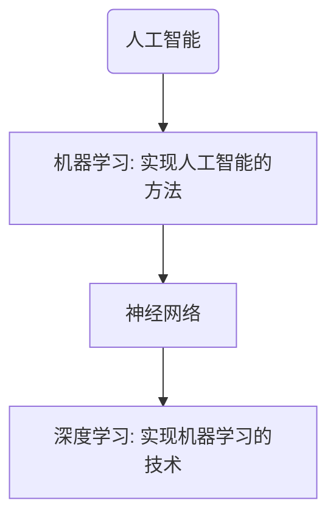

<!-- @import "[TOC]" {cmd="toc" depthFrom=1 depthTo=6 orderedList=false} -->

<!-- code_chunk_output -->

- [1. 基本知识](#1-基本知识)
  - [1.1 包含关系](#11-包含关系)
  - [1.2 神经网络的基本工作原理](#12-神经网络的基本工作原理)
    - [1.2.1 神经元模型](#121-神经元模型)
    - [1.2.2 神经网络的训练过程](#122-神经网络的训练过程)
      - [1.2.2.1 单层神经网络模型：](#1221-单层神经网络模型)
      - [1.2.2.2 训练过程：](#1222-训练过程)
      - [1.2.2.3 步骤：](#1223-步骤)
    - [1.2.3 神经网络的主要功能](#123-神经网络的主要功能)
      - [1.2.3.1 回归](#1231-回归)
      - [1.2.3.2 分类](#1232-分类)

<!-- /code_chunk_output -->

# 1. 基本知识

## 1.1 包含关系

## 1.2 神经网络的基本工作原理

### 1.2.1 神经元模型

对于这个模型，我们模拟人脑，有输入也有输出，

- 输入`imput:`$(x_1,x_2,x_3)$ 是外界输入信号，一般是一个训练数据样本的多个属性，
- 权重 `weights:`$(w_1,w_2,w_3)$ 是每个输入信号的权重值
- 偏移 `bias:`从生物学上解释，在脑神经细胞中，一定是输入信号的电平/电流大于某个临界值时，神经元细胞才会处于兴奋状态，这个 $b$ 实际就是那个临界值。
- 计算 `sum:`计算表达式
- 激活函数 `activation：`求和之后，神经细胞已经处于兴奋状态了，已经决定要向下一个神经元传递信号了，但是要传递多强烈的信号，要由激活函数来确定：$$A=\sigma{(Z)}$$，一般激活函数都是有一个渐变的过程，也就是说是个曲线，如下图：
- 

### 1.2.2 神经网络的训练过程

##### 1.2.2.1 单层神经网络模型：

这是一个单层的神经网络，有 $m$ 个输入 (这里 $m=3$)，有 $n$ 个输出 (这里 $n=2$)。

- $(x_1,x_2,x_3)$ 是一个样本数据的三个特征值
- $(w_{11},w_{21},w_{31})$ 是 $(x_1,x_2,x_3)$ 到 $n1$ 的权重
- $(w_{12},w_{22},w_{32})$ 是 $(x_1,x_2,x_3)$ 到 $n2$ 的权重
- $b_1$ 是 $n1$ 的偏移
- $b_2$ 是 $n2$ 的偏移

##### 1.2.2.2 训练过程：

**训练流程图**：

##### 1.2.2.3 步骤：

1. 随机初始化权重矩阵，可以根据正态分布等来初始化。这一步可以叫做“猜”，但不是瞎猜；
2. 拿一个或一批数据作为输入，带入权重矩阵中计算，再通过激活函数传入下一层，最终得到预测值。
3. 拿 id = 1 样本的真实值 $Y=3$；
4. 计算损失，假设用均方差函数 $Loss = (A-Y)^2=(5-3)^2=4$；
5. 根据一些神奇的数学公式（反向微分），把 $Loss=4$ 这个值用大喇叭喊话，告诉在前面计算的步骤中，影响 $A=5$ 这个值的每一个权重矩阵，然后对这些权重矩阵中的值做一个微小的修改；
6. 用 Id-2 样本作为输入再次训练（Go to 2）；
7. 这样不断地迭代下去，直到以下一个或几个条件满足就停止训练：损失函数值非常小；准确度满足了要求；迭代到了指定的次数。

### 1.2.3 神经网络的主要功能

##### 1.2.3.1 回归

​ 单层的神经网络能够模拟一条二维平面上的直线，从而可以完成线性分割任务。而理论证明，两层神经网络可以无限逼近任意连续函数。下面就是由两个构成的复杂神经网络

简单来说：**所谓回归或者拟合，其实就是给出 x 值输出 y 值的过程，并且让 y 值与样本数据形成的曲线的距离尽量小，可以理解为是对样本数据的一种骨架式的抽象。**

下面图的意思就是：红色的点所连成的线就是神经网络的学习结果，它可以“穿过”样本点群形成中心线，尽量让所有的样本点到中心线的距离的和最近。

##### 1.2.3.2 分类

所谓分类问题，我们使用一个两层的神经网络可以得到一个非常近似的结果，使得分类误差在满意的范围之内。下图中那条淡蓝色的曲线，可以比较完美地把两类样本分开，所以分类可以理解为是对两类或多类样本数据的边界的抽象。

_分类与回归是监督学习中的两个主要任务，它们即对应了监督学习中“学习”的部分_
